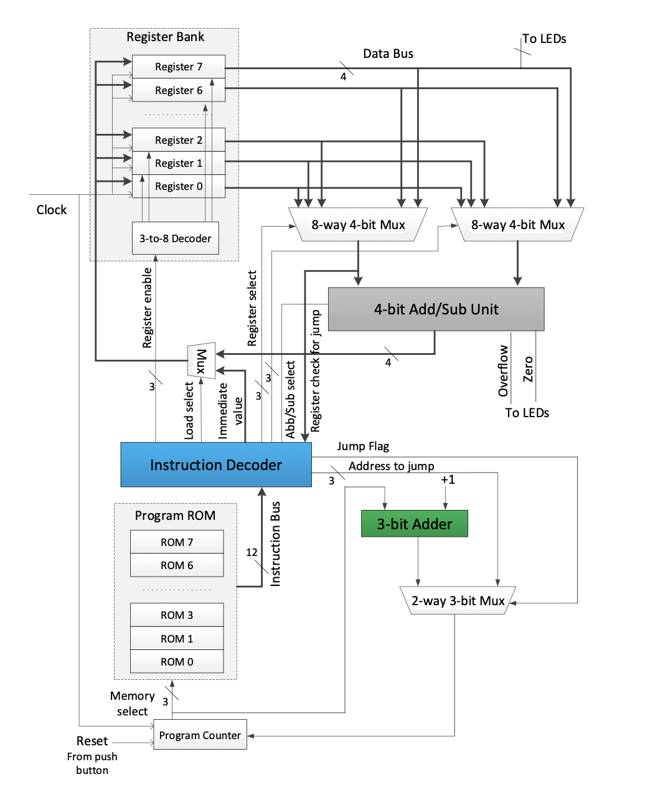
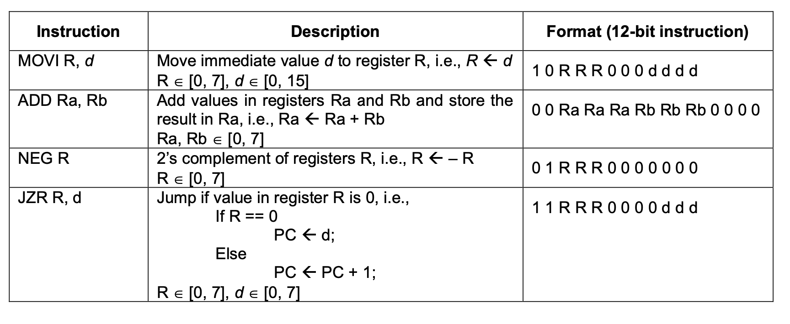
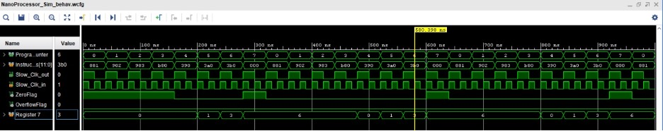

# NanoProcessor

## Description

A simplified nanoprocessor designed to run on the Basys3 FPGA. Desgined using Xlinx Vivado with VHD. The NanoProcessor is designed using Registers, Add/Sub Unit, Decoders, Multiplexers which have been implemented seperately.

The Nano Processor is built to support 4 instructions MOV, ADD, NEG and JZR.

Instructions are hardcoded into the ROM and loaded at runtime. The sample program to add the integers from 1-3 has been currently implemented. (1+2+3=6)
The result is mapped to be displayed on the 7 segment display of the FPGA. The timing diagram of the simulation of the program is shown below.

## Installation

Clone the project using git.

Open the project in Xlinx Vivado and upload the `NanoProcessor.bit` file to the FPGA.

## Usage

The final NanoProcessor uses several lower level components to implement its functionality. Each component is implemented within its own directory and imported into the NanoProcessor file.

You can change the lower level components within each directory, and re-import into the NanoProcessor.

## Contributors

[Adam Moraes](https://github.com/roshanemoraes)  
[Kevin Fernando](https://github.com/JudeKFdo)
